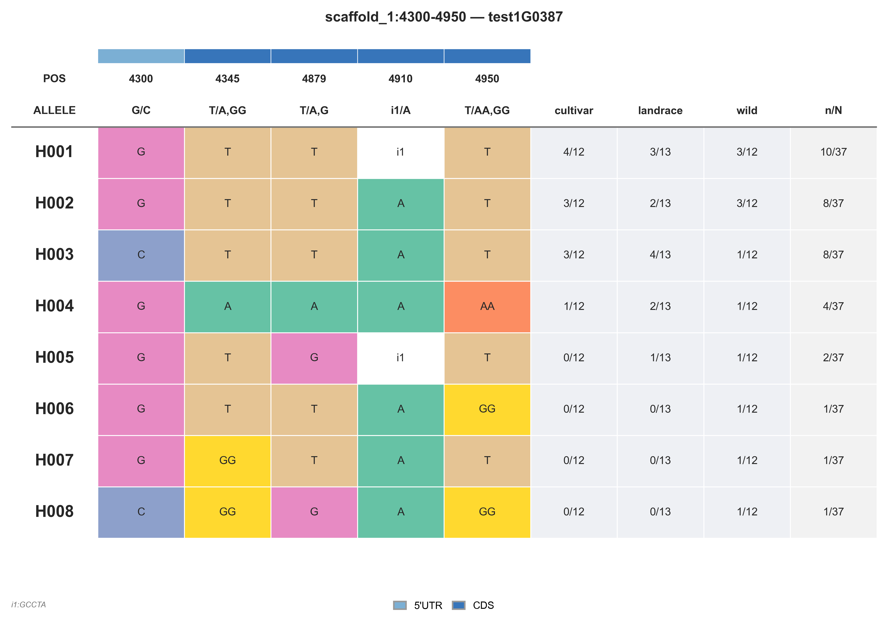
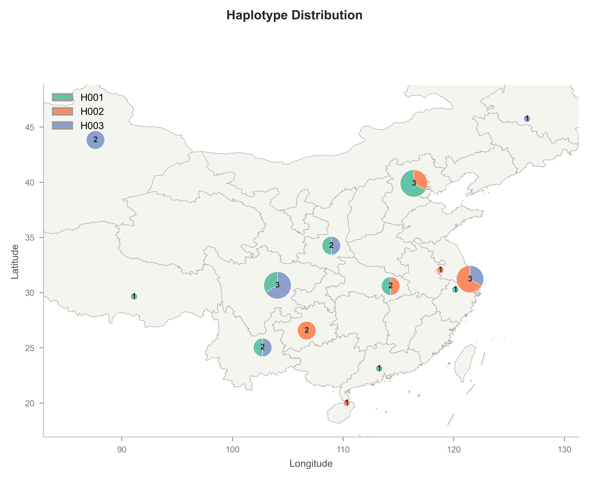

# haplokit

CLI-first haplotype viewer with bcftools-like selectors, C++ backend acceleration, and Python plotting.

<!-- README-I18N:START -->

**English** | [汉语](./README.zh-CN.md)

<!-- README-I18N:END -->

## Installation

### Requirements

- Linux or WSL (release lane is Linux-first)
- Python 3.10+
- C++17 toolchain and CMake 3.22+ for source builds

### Install from PyPI

```bash
python -m pip install haplokit
```

### Install from source

```bash
python -m venv .venv
source .venv/bin/activate
python -m pip install -U pip
python -m pip install -e .[test]
```

## Quick Start

```bash
haplokit view data/var.sorted.vcf.gz -r scaffold_1:4300-5000 --output-file out
```

This writes:

- `out/hapresult.tsv`
- `out/hap_summary.tsv`

## Figures

### Haplotype Summary Table



The haplotype summary table displays all identified haplotypes across variant positions in the selected genomic region. Each visual component conveys specific information:

- **Title**: Shows the genomic region (`CHR:start-end`) and, when `--gff` is provided, the overlapping gene name.
- **Functional category strip** (`--gff` only): A thin colored bar above the POS row. Each variant position is classified into a SnpEff-style functional category (CDS, UTR, exon, intron, upstream/downstream, intergenic) based on GFF3 annotation. Provides an at-a-glance view of which functional regions the variants fall in.
- **POS row**: Physical positions of each variant site.
- **ALLELE row**: The alternate allele at each position, color-coded by allele identity.
- **Haplotype rows** (H001, H002, ...): Each row represents one distinct haplotype pattern. Cells show the allele carried at each position. Empty cells indicate the reference allele.
- **Population columns** (`--population` only): Columns for each population (e.g., wild, landrace, cultivar) showing sample counts per haplotype.
- **n/N column**: Frequency of each haplotype as count/total.
- **SnpEff-style legend** (`--gff` only): Legend at the bottom showing functional category colors (CDS, UTR, exon, intron, intergenic).
- **Indel footnotes**: Multi-allele indels (e.g., `T/A,GG`) are annotated with superscript markers; full sequences are explained in the footnote area.

### Haplotype Geographic Distribution



The geographic distribution map overlays haplotype composition pie charts onto a base map, revealing spatial patterns of haplotype variation across sampling locations.

- **Base map**: Province-level boundary polygons from GeoJSON (China via Aliyun DataV API).
- **Pie charts**: At each sampling location, a pie chart shows haplotype composition. Each slice represents one haplotype.
- **√ frequency scaling**: Symbol size proportional to √(total sample count), matching R's `symbol.lim` logic.
- **Count labels**: The total sample count at each location is displayed at the center of each pie chart.
- **Coordinate axes**: Longitude (x) and Latitude (y) with degree tick marks in muted grey.
- **Legend**: Haplotype color legend in the upper-left corner identifies each haplotype.
- **Title**: Optional figure title.

## bcftools-like selector semantics

`haplokit view` follows the same selector vocabulary shape used in `bcftools` workflows.

- `-r/--region chr:start-end` selects a range
- `-r/--region chr:pos` selects a single site
- `-R/--regions-file regions.bed` processes BED rows independently
- `-S/--samples-file samples.list` keeps only listed samples

Validation rules:

- Exactly one of `-r` or `-R` is required
- `-r` and `-R` are mutually exclusive
- `--by site` is only valid with `-r chr:pos`
- `--by region` conflicts with `-r chr:pos`
- `--by site` conflicts with `-r chr:start-end`

## C++ backend acceleration

The Python CLI delegates heavy hap grouping work to `haplokit_cpp`.

### Vendored libraries

- **[htslib](https://github.com/samtools/htslib)** — C library for reading/writing high-throughput sequencing data. Provides native support for VCF and BCF formats, with indexed random access and efficient genotype decoding. Linked as a static library at build time.

- **[gffsub](https://github.com/WWz33/gffsub)** — Lightweight GFF3/GTF parser and filter. Parses gene annotation files, supports feature-type filtering (longest transcript selection), and provides overlap/nearest-gene queries for haplotype annotation.

Backend discovery order:

1. `HAPLOKIT_CPP_BIN`
2. packaged binary: `haplokit/_bin/haplokit_cpp`
3. repo builds: `build-wsl/haplokit_cpp`, then `build/haplokit_cpp`
4. fallback local build: `cmake -S . -B build-wsl` and `cmake --build build-wsl --clean-first -j1`

If no backend is found after discovery/build, the CLI exits with an explicit error.

## Command

```text
haplokit view <input_vcf> (-r <region> | -R <regions.bed>) [options]
```

`<input_vcf>` should be an indexed VCF/BCF file (`.vcf.gz` + `.tbi`, or BCF index).

## Options and Defaults

| Option | Type | Default | Behavior |
| --- | --- | --- | --- |
| `input_vcf` | positional path | `None` in parser (required in practice) | Input indexed VCF/BCF |
| `-r, --region` | selector string | `None` | `chr:start-end` or `chr:pos` |
| `-R, --regions-file` | BED path | `None` | BED rows need at least 3 tab-separated columns |
| `-S, --samples-file` | sample list path | `None` | One sample ID per line |
| `--by` | `auto \| region \| site` | `auto` | Auto-resolves from selector shape; parser enforces consistency |
| `--impute` | flag | `False` | Impute missing genotypes as reference before grouping |
| `-g, --gff3, --gff` | GFF/GFF3 path | `None` | Enable gene overlap/nearest annotation |
| `-p, --population` | population file path | `None` | Tab-separated file mapping sample → population group |
| `--output` | `summary \| detail` | `summary` | Used in JSONL mode; TSV mode always writes both tables |
| `--output-format` | `tsv \| jsonl` | `tsv` | `tsv` is default contract |
| `--output-file` | path | `None` | Directory, prefix file, or explicit JSONL file |
| `--plot` | flag | `False` | Render one haplotype table figure per selector |
| `--plot-format` | `png \| pdf \| svg \| tiff` | `png` | Output figure format |
| `--max-diff` | float in `[0,1]` | `None` | Enables approximate grouping with threshold |

## Output Behavior (Current Implementation)

### `--output-format tsv` (default)

- Always writes both:
  - `hapresult*.tsv`
  - `hap_summary*.tsv`
- `--output` does not change this TSV pair behavior.
- With `--plot`, also writes one figure file per selector (format set by `--plot-format`).
- With `--gff/--gff3`, also writes `gff_ann_summary.tsv`.

File naming rules:

- Single selector, no `--output-file`: write to current directory as `hapresult.tsv` and `hap_summary.tsv`
- `--output-file <dir>` (no suffix): write into that directory
- `--output-file <path/custom.tsv>`: use prefix naming:
  - `custom.hapresult.tsv`
  - `custom.hap_summary.tsv`
- BED multi-selector mode: append slug per selector:
  - `hapresult_<chrom>_<start>_<end>.tsv`
  - `hap_summary_<chrom>_<start>_<end>.tsv`
  - if collisions occur, append `_<NNN>`

### `--output-format jsonl` (compatibility mode)

- If `--output-file` is omitted, write JSONL to stdout.
- If `--output-file` is a directory path, write `<dir>/result.jsonl`.
- If `--output-file` is a file path, write to that exact file.
- `--output summary|detail` is respected in JSONL mode.

## Examples

### Region mode (strict exact grouping)

```bash
haplokit view in.vcf.gz -r chr1:1000-2000 --output-file out
```

### Site mode

```bash
haplokit view in.vcf.gz -r chr1:1450 --output-file out_site
```

### BED batch + sample subset + plot + annotation

```bash
haplokit view in.vcf.gz -R regions.bed -S samples.list --plot --gff genes.gff3 --output-file out_bed
```

### With population groups and PNG figure

```bash
haplokit view in.vcf.gz -r chr1:1000-2000 -p popgroup.txt --plot --plot-format png --output-file out
```

### JSONL detail mode with approximate grouping

```bash
haplokit view in.vcf.gz -r chr1:1000-2000 --max-diff 0.2 --output-format jsonl --output detail --output-file result.jsonl
```

## Upgrading Notes

- Default output is now TSV (`hapresult/hap_summary` pair).
- Keep `--output-format jsonl` only for compatibility workflows.
- Default figure format is now PNG (was triple SVG+PDF+TIFF). Use `--plot-format` to select.

## Contributing

Linux/WSL validation path:

```bash
cmake -S . -B build-wsl
cmake --build build-wsl -j12
HAPLOKIT_CPP_BIN=$PWD/build-wsl/haplokit_cpp python -m pytest -q tests/python
ctest --test-dir build-wsl --output-on-failure
```

See:

- `docs/specs/haplokit-view-cli.md`
- `docs/specs/haplokit-result-schema.md`
- `docs/development/haplokit-linux-workflow.md`
- `docs/release/pypi-release.md`

## Acknowledgements

haplokit is inspired by geneHapR:

> Zhang, R., Jia, G. & Diao, X. geneHapR: an R package for gene haplotypic statistics and visualization. BMC Bioinformatics 24, 199 (2023). https://doi.org/10.1186/s12859-023-05318-9

## License

GPL-3.0-or-later.
