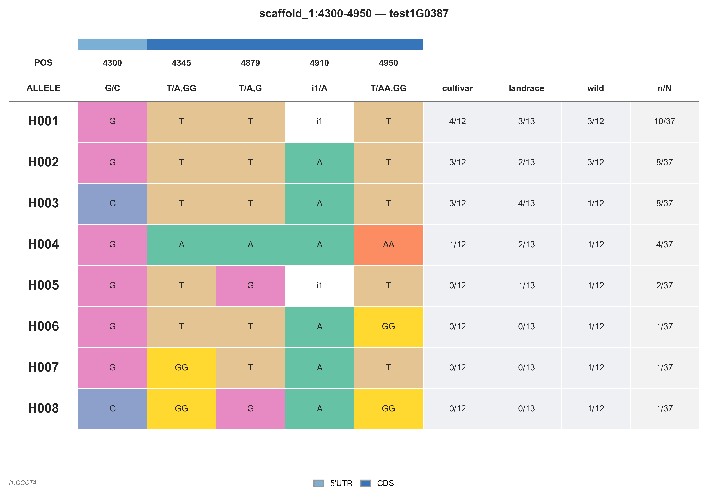
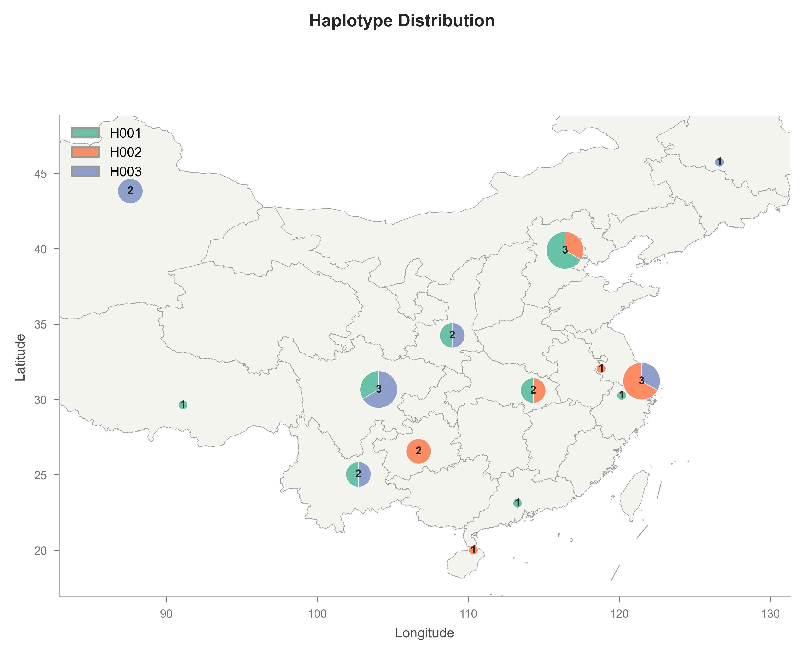
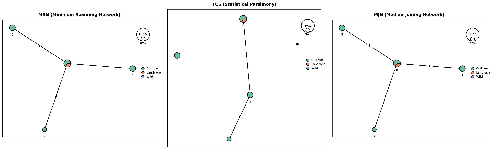
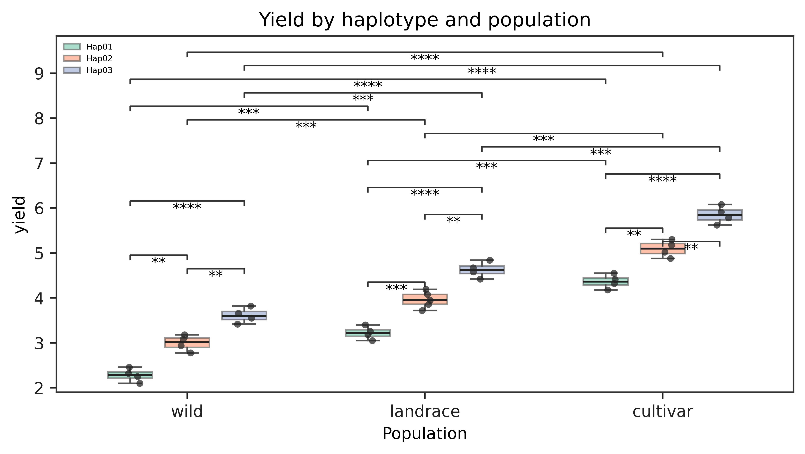

# haplokit

面向 CLI 的单倍型查看工具，提供 C++ 后端加速、表型统计和 Python 绘图。

<!-- README-I18N:START -->

[English](./README.md) | **汉语**

<!-- README-I18N:END -->

## 安装

```bash
pip install haplokit
```

> 源码构建需要 Linux/WSL、Python 3.10+、C++17 工具链、CMake 3.22+ — 见[贡献开发](#贡献开发)。

从 git clone 的源码目录安装：

```bash
pip install .
```

开发模式安装也会通过 PEP 660 editable wheel hook 把 C++ 后端编译到源码树内：

```bash
pip install -e .
```

如果后端编译在其他位置，可以显式指定：

```bash
export HAPLOKIT_CPP_BIN=/path/to/haplokit_cpp
```

## 快速开始

```bash
haplokit view data/var.sorted.vcf.gz -r scaffold_1:4300-5000 --output-file out
```

输出：

- `out/hapresult.tsv` — 逐样本单倍型详情
- `out/hap_summary.tsv` — 单倍型计数汇总

## 使用场景

### 1. 区域查询 — 严格精确分组

识别基因组区域内的所有不同单倍型。

```bash
haplokit view in.vcf.gz -r chr1:1000-2000 --output-file out
```

在 `out/` 中生成 `hapresult.tsv` + `hap_summary.tsv`。每行单倍型展示精确等位基因模式；含杂合或缺失呼叫的样本被排除。

### 2. 单位点查询

分析单个变异位点的单倍型。

```bash
haplokit view in.vcf.gz -r chr1:1450 --output-file out_site
```

`--by` 对 `chr:pos` 选择器自动推断为 `site`。

### 3. 基因注释 + 图表

在单倍型表上叠加基因结构。

```bash
haplokit view in.vcf.gz -r chr1:1000-2000 --gff genes.gff3 --plot --output-file out
```

`genes.gff3` 格式（标准 GFF3）：

```text
chr1	.	gene	1000	3000	.	+	.	ID=gene1;Name=GeneA
chr1	.	CDS	1200	1500	.	+	0	ID=cds1;Parent=gene1
```

添加 SnpEff 风格功能分类色带（CDS、UTR、exon、intron、intergenic）到变异位点上。输出图片（`out/*.png`）+ `gff_ann_summary.tsv`。



图表组件：

- **标题**：区域 + 重叠基因名（提供 `--gff` 时）
- **功能色带**（仅 `--gff`）：彩色条按功能类别标注每个变异
- **POS / ALLELE 行**：变异位置和替代等位基因
- **单倍型行**（H001、H002、...）：每位点等位基因；空 = 参考
- **群体列**（`--population`）：各群体各单倍型样本数
- **n/N**：单倍型频率
- **图例**（仅 `--gff`）：功能类别颜色
- **Indel 脚注**：多等位基因 Indel 用上标标记标注

### 4. 群体分组

比较不同群体间的单倍型分布。

```bash
haplokit view in.vcf.gz -r chr1:1000-2000 -p popgroup.txt --plot --output-file out
```

`popgroup.txt`（Tab 分隔：`sample<TAB>population`）：

```text
C1	wild
C2	wild
C13	landrace
```

在表和图中添加群体列。

### 5. 地理分布图

在采样地点上映射单倍型组成。

```bash
haplokit view in.vcf.gz -r chr1:1000-2000 -p popgroup.txt --geo data/sample_china_geo.txt --plot --output-file out
```

`sample_china_geo.txt` 和 `sample_world_geo.txt` 是 Tab 分隔的坐标示例（`ID<TAB>longitude<TAB>latitude<TAB>Hap`）。`Hap` 列用于独立绘图示例；CLI 地图绘图会从 VCF 结果中推断每个样本的单倍型。

```text
ID	longitude	latitude	Hap
C1	116.40	39.90	H001
C2	116.40	39.90	H002
C3	116.40	39.90	H001
```



`data/` 下包含世界地图示例资源：

- `sample_world_geo.txt` 与 `sample_china_geo.txt` 保持相同的 `ID/Hap` 组成，只把坐标替换为全球采样地点。
- `world_countries.shp`、`world_countries.shx` 和 `world_countries.dbf` 提供示例世界地图 shapefile。
- `haplotype_map_world.png` 是 `data/figure/` 下生成好的世界地图示例图。


图表组件：

- **饼图**：每位置单倍型组成；大小 ∝ √(样本数)
- **颜色图例**：单倍型颜色键
- **气泡大小图例**：ggplot2 风格分级圆圈，展示样本数刻度
- **底图**：GeoJSON 省界多边形（中国）或随附的世界地图 shapefile 示例

### 6. 单倍型网络 — popart 风格

构建单倍型网络，以 [popart](https://popart.maths.otago.ac.nz/) (Leigh & Bryant, 2015) 的视觉规范呈现。支持三种推断方法：TCS (Clement et al. 2002)、MSN 和 MJN (Bandelt, Forster & Röhl 1999)。

```bash
haplokit view in.vcf.gz -r chr1:1000-2000 -p popgroup.txt --network --plot --output-file out
haplokit view in.vcf.gz -r chr1:1000-2000 --network --network-method mjn --plot --output-file out
```

图表组件：

- **节点**：每个单倍型一个圆；面积 ∝ √(样本数)
- **饼图扇区**（配合 `-p`）：单倍型的群体组成
- **边**：理想长度正比于突变距离（力导向布局）
- **边上的横线刻度**：每条横线代表一个突变（popart 规范）
- **小黑点**：TCS 推断的中间（祖先）节点



### 7. 表型统计模块

`haplokit phenotype` 将单倍型分配结果和样本表型表连接起来。输入可以是
`haplokit view` 输出的 `hapresult.tsv`，也可以是 `samples,haplotypes` 形式的两列表。
表型表第一列为样本 ID，其余列为数值性状。模块保持“后端计算、前端绘图”的边界：
统计检验在数据层完成，绘图层只负责可视化。

```bash
haplokit phenotype \
  --hapresult out/hapresult.tsv \
  --phenotypes phenotype.csv \
  --population popgroup.txt \
  --trait yield \
  --min-hap-size 5 \
  --method welch \
  --output yield_stats.tsv \
  --summary-output yield_summary.tsv

haplokit phenotype \
  --hapresult out/hapresult.tsv \
  --phenotypes phenotype.csv \
  --population popgroup.txt \
  --trait yield \
  --min-hap-size 5 \
  --method welch \
  --output yield_stats.tsv \
  --plot-box \
  --comparison Hap01,Hap02 \
  --figsize 7,4 \
  --plot-format pdf \
  --box-output yield_box.pdf
```

表型统计流程对每个性状运行单因素 ANOVA 和单倍型两两检验。两两检验方法可用
`--method` 显式选择，包括 `welch`（默认）、`student`、`mannwhitney` 和 `tukey`；
非 Tukey 检验默认使用 Bonferroni 校正。低于 `--min-hap-size` 的单倍型分组会按性状
剔除。提供 `--population/--pop-group` 时，检验按群体分层执行，输出包含 `population`
列。表型缺失值（`NA`、`NaN`、`null`、`.` 或空单元格）会按性状忽略，`effective_n`
报告进入该检验分层的有效样本数。

`--plot-box` 将箱线图作为同一套表型统计和分组逻辑的可视化输出：沿用相同的单倍型过滤、
群体分层和比较规则，再将一个性状绘制为发表用箱线图。提供 `--population` 时，箱线图按
群体分组，单倍型以并排箱体显示；星号显著性标注绘制在图内，包括组内单倍型比较和同一
单倍型的组间比较。只有一个单倍型时，仅展示群体之间的比较。

示例输入位于 `data/example_phenotype_haplotypes.tsv`、`data/example_phenotype.csv`
和 `data/popgroup.txt`：

```bash
haplokit phenotype \
  -H data/example_phenotype_haplotypes.tsv \
  -P data/example_phenotype.csv \
  -p data/popgroup.txt \
  -t yield \
  -m 4 \
  --plot-box \
  -F png \
  -T "Yield by haplotype and population" \
  -b data/figure/phenotype_population_boxplot.png
```



### 8. BED 批处理

一次运行处理多个区域。

```bash
haplokit view in.vcf.gz -R regions.bed --output-file out_batch
```

`regions.bed`（≥3 列，Tab 分隔）：

```text
chr1	1000	2000
chr2	5000	6000
```

每行 BED 独立处理。输出文件按区域 slug 加后缀（`_chr1_1000_2000`）。

### 9. 近似分组

在容差范围内聚类相似单倍型。

```bash
haplokit view in.vcf.gz -r chr1:1000-2000 --max-diff 0.2 --output-file out
```

`--max-diff`（0–1）：差异 ≤ 20% 位点的单倍型归为一组。分组模式从 `strict-region` 变为 `approx-region`。

### 10. 样本子集 + 填补

限制分析到特定样本；缺失呼叫按参考等位基因填补。

```bash
haplokit view in.vcf.gz -r chr1:1000-2000 -S samples.list --impute --output-file out
```

`samples.list`（每行一个样本 ID）：

```text
C1
C5
C16
```

`--impute` 将缺失 GT 视为 `0/0`，提高样本保留率。

## 输出文件

### `hapresult.tsv` — 逐样本单倍型详情

```text
CHR     scaffold_1  scaffold_1  ...  Haplotypes:  8
POS     4300        4345        ...  Individuals: 37
INFO    .           .           ...  Variants:    5
ALLELE  G/C         T/A,GG      ...  Accession
H001    G           T           ...  C8;C9;C11;C14;C18;C25;C26;C28;C31;C35
```

- **表头行**（CHR/POS/INFO/ALLELE）：跨列变异元数据
- **单倍型行**（H001–HNNN）：每位点等位基因；空 = 参考；携带该单倍型的样本列表

### `hap_summary.tsv` — 单倍型计数汇总

与 `hapresult.tsv` 表头相同，多一列 `freq`（计数/总数）：

```text
H001  G   T   T   GCCTA  T   10
H002  G   T   T   A      T   8
H003  C   T   T   A      T   8
```

### `gff_ann_summary.tsv` — 基因注释（仅 `--gff`）

```text
chr           start  end   ann
scaffold_1    4300   5000  test1G0387
```

### 图片文件（`--plot`）

格式由 `--plot-format` 设定（默认 `png`）。按区域 slug 命名：`<prefix>.<chr>_<start>_<end>.png`。

## 完整参数

### `haplokit view`

```
haplokit view [input_vcf] (-r <region> | -R <regions.bed> | --gene-id <id> | --gene-list <file>) [options]
```

`<input_vcf>` 须为已索引 VCF/BCF（`.vcf.gz` + `.tbi`，或 BCF 索引）。

| 参数 | 类型 | 默认值 | 说明 |
| --- | --- | --- | --- |
| `input_vcf` | 路径 | — | 已索引 VCF/BCF 输入文件 |
| `-r, --region` | 字符串 | — | `chr:start-end` 或 `chr:pos` |
| `-R, --regions-file` | 路径 | — | BED 文件（≥3 列，Tab 分隔） |
| `-G, --gene-id` | 字符串 | — | 通过 `--gff/--gff3` 解析一个基因 ID |
| `-l, --gene-list` | 路径 | — | 每行一个基因 ID；需要 `--gff/--gff3` |
| `-S, --samples-file` | 路径 | — | 每行一个样本 ID |
| `-b, --by` | `auto\|region\|site` | `auto` | 分组模式；auto 按选择器形态推断 |
| `-i, --impute` | 开关 | 关 | 缺失 GT 按参考等位基因填补 |
| `-m, --max-diff` | 浮点 [0,1] | — | 近似分组阈值 |
| `-g, --gff3, --gff` | 路径 | — | 用于基因选择器和绘图的 GFF3/GTF 注释 |
| `-u, --upstream` | 整数 | `0` | 基因选择器上游扩展碱基数 |
| `-d, --downstream` | 整数 | `0` | 基因选择器下游扩展碱基数 |
| `-a, --strand-aware` | 开关 | 关 | 按基因链方向应用 upstream/downstream |
| `-o, --output` | `summary\|detail` | `summary` | 仅 JSONL 模式生效；TSV 总是双表 |
| `-f, --output-format` | `tsv\|jsonl` | `tsv` | 输出格式 |
| `-O, --output-file` | 路径 | — | 输出目录、前缀或 JSONL 文件 |
| `-P, --plot` | 开关 | 关 | 生成单倍型表图 |
| `-F, --plot-format` | `png\|pdf\|svg\|tiff` | `png` | 图片格式 |
| `-z, --figsize` | `WIDTH,HEIGHT` | 自动 | 表格图和地图图尺寸（英寸） |
| `-p, --population` | 路径 | — | Tab 分隔的 样本→群体 映射 |
| `-e, --geo` | 路径 | — | 样本地理坐标（用于地图） |
| `-C, --map-facecolor` | 颜色 | `#f5f5f0` | 地图背景色 |
| `--show-counts` / `--hide-counts` | 开关 | 隐藏 | 显示或隐藏地图饼图中心样本数 |
| `-n, --network` | 开关 | 关 | 渲染单倍型网络（popart 风格） |
| `-N, --network-method` | `tcs`/`msn`/`mjn` | `tcs` | 网络推断算法 |
| `-H, --hap-prefix` | 字符串 | `Hap` | 单倍型标签前缀 |
| `-D, --hap-pad` | 整数 | `2` | 单倍型编号补零宽度 |

选择器规则：`-r`、`-R`、`--gene-id`、`--gene-list` 必须且只能提供一个。基因选择器需要
`--gff/--gff3`；`--upstream`、`--downstream`、`--strand-aware` 只对基因选择器有效。
`--by site` 仅可用于 `-r chr:pos`。

### `haplokit phenotype`

```
haplokit phenotype -H <hapresult.tsv> -P <phenotype.csv> [options]
```

| 参数 | 类型 | 默认值 | 说明 |
| --- | --- | --- | --- |
| `-H, --hapresult, --haplotypes` | 路径 | 必填 | `hapresult.tsv` 或两列 sample-haplotype 表 |
| `-P, --phenotypes, --phenotype, --pheno-file` | 路径 | 必填 | 表型表；第一列为样本 ID，其余列为性状 |
| `-p, --population, --pop-group` | 路径 | — | 样本到群体表；检验和箱线图按群体分层 |
| `-t, --trait` | 字符串 | 所有数值性状 | 分析的性状；可重复指定多个 |
| `-m, --min-hap-size` | 整数 | `5` | 每个检验分层内单倍型的最小有效样本数 |
| `-M, --method` | `welch\|student\|mannwhitney\|tukey` | `welch` | 显式选择两两检验公式/方法 |
| `-a, --adjust` | `bonferroni\|none` | `bonferroni` | 非 Tukey 两两检验的 p 值校正 |
| `-o, --output` | 路径 | `phenotype_stats.tsv` | 两两统计结果 TSV |
| `-s, --summary-output` | 路径 | — | 可选的单倍型汇总统计 TSV |
| `-B, --plot-box` | 开关 | 关 | 同时为选定性状输出箱线图 |
| `-b, --box-output` | 路径 | `phenotype_box.png` | `--plot-box` 的输出路径 |
| `-F, --plot-format` | `png\|pdf\|svg\|tiff` | 输出后缀 | 箱线图格式 |
| `-z, --figsize` | `WIDTH,HEIGHT` | 自动 | 箱线图尺寸（英寸） |
| `-T, --title` | 字符串 | — | 箱线图标题 |
| `-c, --comparison` | `HapA,HapB` | — | `--plot-box` 中标注的一对单倍型；可重复 |
| `-d, --delimiter` | `auto\|tab\|comma` | `auto` | hapresult/sample-haplotype 输入分隔符 |
| `-D, --phenotype-delimiter` | `auto\|tab\|comma` | `auto` | 表型输入分隔符 |
| `-G, --population-delimiter` | `auto\|tab\|comma` | `auto` | 群体输入分隔符 |

`--plot-box` 要求最终只选中一个性状。若表型表中有多个数值性状，请用 `--trait` 指定要绘制的性状。

## 后端

C++ 后端（`haplokit_cpp`）处理 VCF 读取和单倍型分组。发现顺序：

1. `HAPLOKIT_CPP_BIN` 环境变量
2. 打包内二进制：`haplokit/_bin/haplokit_cpp`
3. 仓库构建产物：`build-wsl/haplokit_cpp` → `build/haplokit_cpp` → `build-haplokit-python/haplokit_cpp`
4. 回退：从源码树自动运行 `cmake` 构建；失败时报告 CMake 的真实错误

供应商依赖库：

- **[htslib](https://github.com/samtools/htslib)** — VCF/BCF 读取，索引随机访问
- **[gffsub](https://github.com/WWz33/gffsub)** — GFF3/GTF 解析，overlap/nearest-gene 查询

### 网络算法

C++ 实现的单倍型网络算法（MSN、TCS、MJN），支持 SIMD 加速：

- **库**：`libhaplokit_network.a`（C++17）
- **算法**：MSN（最小生成网络）、TCS（统计简约）、MJN（中间连接）
- **优化**：AVX2 SIMD Hamming 距离、OpenMP 并行
- **Python 接口**：`haplokit.network`，自动 C++/Python 回退
- **可视化**：PopART 风格渲染，饼图节点、突变刻度线、性状图例

纯 Python 参考实现归档于 `archive/python_reference_implementation/`。

## 贡献开发

```bash
cmake -S . -B build-wsl && cmake --build build-wsl -j12
HAPLOKIT_CPP_BIN=$PWD/build-wsl/haplokit_cpp python -m pytest -q tests/python
ctest --test-dir build-wsl --output-on-failure
```

## 致谢

设计灵感来自 geneHapR：

> Zhang, R., Jia, G. & Diao, X. geneHapR: an R package for gene haplotypic statistics and visualization. BMC Bioinformatics 24, 199 (2023). https://doi.org/10.1186/s12859-023-05318-9

网络可视化遵循 [popart](https://popart.maths.otago.ac.nz/) 的规范：

> Leigh, J. W. & Bryant, D. popart: full‐feature software for haplotype network construction. Methods in Ecology and Evolution 6, 1110–1116 (2015). https://doi.org/10.1111/2041-210X.12410

## 许可证

GPL-3.0-or-later
