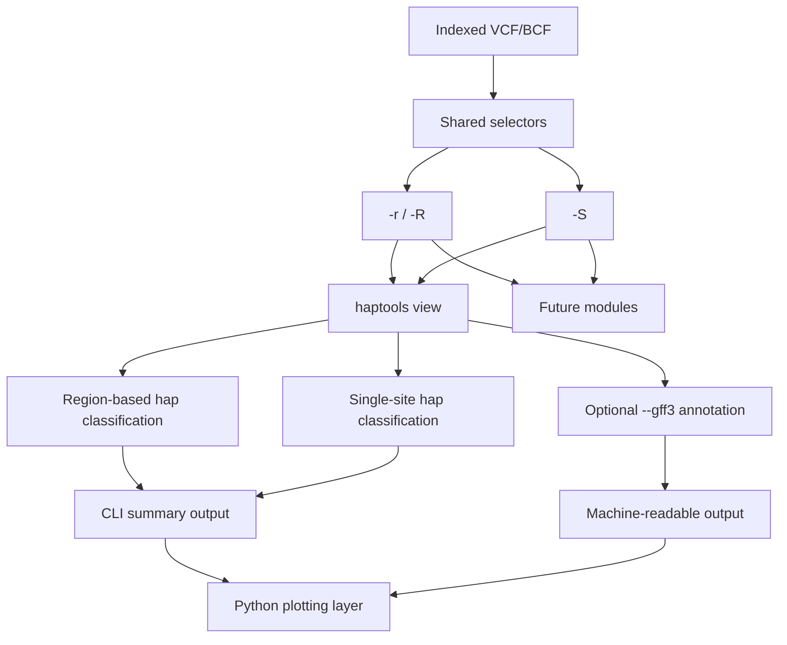

# Haptools CLI Rewrite

## Problem Frame

`geneHapR` already covers a broad haplotype analysis surface: genotype import, interval filtering, hap classification, phenotype association, and multiple visualization modes. But the current product shape is an `R` package with a Windows-only Shiny wrapper, and its main data path is built around `vcfR` objects and in-memory transforms. Large-VCF preprocessing still relies on line-by-line text scanning in `R/filter_preprocessbigVCF.R`, and `R/GUI_geneHapR.R` explicitly states that a future Python rewrite is needed for large bio-data workloads.

This requirements document is scoped to `haptools` only. `geneHapR` is treated as upstream scientific/product reference context, not as an implementation target for this project.

This makes the current tool unsuitable as a high-frequency data-plane utility in three ways:

- it does not provide a real composable CLI like `bcftools`
- large-file IO and region extraction are too slow because the workflow does not center indexed iteration
- computation and plotting are tightly coupled, so "fast classification" and "user-customizable plotting" cannot evolve independently

The rewrite goal is not a direct port of the `R` code. It is to rebuild the core value of `geneHapR` as a CLI-first toolchain with a `bcftools`-like command vocabulary: different modules do different jobs, but shared selectors such as region and sample filters are reusable across modules. `C++` handles the high-performance VCF/BCF data plane and hap classification, while `Python` handles result consumption, statistics display, and a plotting layer whose themes can be changed later by the user.

The original package also suggests an important scientific baseline: for sequence-driven haplotypes, it expects aligned and trimmed sequences before hap assignment, which means the default conceptual model is a strict site-by-site grouping rather than an informal similarity bucket. Any approximate grouping introduced by the rewrite therefore needs an explicit scientific justification and must not silently replace the strict mode.

## Requirements

**Current Capability Baseline**
- R1. The rewrite must preserve the core analysis chain that gives `geneHapR` its value: interval selection, hap classification, hap-summary-like output, hapResult-like detailed output, and an output abstraction that downstream plotting can consume.
- R2. Requirements and planning must treat the existing repository as the capability baseline rather than re-inventing scope. The key baseline sources are `R/IO.R`, `R/filter.R`, `R/filter_preprocessbigVCF.R`, `R/hap2vcf.R`, `R/vis_hapVisualization.R`, `R/vis_phenos.R`, and `vignettes/Introduction_of_geneHapR.Rmd`.

**CLI-First Data Plane**
- R3. The new tool must be command-line first and use a subcommand shape similar to `bcftools`, where modules are separated by responsibility, `haptools view` is the core first entry point, and shared selection semantics can be reused across modules.
- R4. `haptools view` must support single-region selection: `haptools view -r chr:start-end ...`.
- R5. `haptools view` must support batched region selection from a region file: `haptools view -R regions.bed ...`.
- R6. When `-R regions.bed` is used, each BED row must be hap-classified independently and emitted independently. The implementation must not merge all BED intervals into one combined class before classification.
- R7. `haptools view` must support sample subset input: `-S sample.list`.
- R8. v1 does not need to support phenotype input. The earlier `-p` / `--phenotype` idea is deferred until the phenotype contract is designed clearly enough to avoid locking in the wrong interface.
- R9. `haptools view` must expose two result shapes analogous to current `geneHapR` outputs: one summary-oriented shape similar to `hap_summary`, and one detail-oriented shape similar to `hapResult`.
- R10. `haptools view` must support `--gff3 <file>` to attach interval-level nearby-gene annotation from a GFF3 file.
- R11. When `--gff3` is used, the output should report gene context close to the queried interval in a way that is conceptually similar to annotation helpers such as `snpEff`, but scoped to interval/gene proximity rather than full variant-effect prediction.
- R12. Shared selectors such as `-r`, `-R`, and `-S` should be designed as reusable semantics rather than logic hard-coded only for one subcommand.
- R13. Hap classification must support more than one classification strategy. In addition to region-based classification, v1 should support single-site or single-SNP-based classification for users whose workflows do not treat a region as the hap unit.
- R14. Hap classification must support a strict mode that preserves the current scientific baseline: hap groups are defined by exact genotype or aligned-site state combinations within the selected unit.
- R15. If approximate hap grouping is introduced, it must be explicit, scientifically defensible, and clearly distinguished from strict grouping rather than presented as the default equivalent.
- R16. Missing-data handling must be an explicit user choice rather than being silently tied to strict or approximate grouping mode.
- R17. In v1, `--impute` means imputation to the reference state. It is a boolean preprocessing switch, not a method family with multiple algorithms.

**Performance and IO**
- R18. v1 must be built around indexed VCF/BCF access and should prioritize `htslib` for indexing, iteration, and compressed IO rather than keeping the current `R` line-scan model for large files.
- R19. v1 core commands must be pipeline-friendly by default. Output must support stdout or explicit output files and must not require an interactive interface.
- R20. The data plane and the plotting layer must be decoupled. High-performance reading, sample filtering, interval traversal, hap classification, and interval annotation must not depend on Python plotting libraries or GUI runtime state.

**Layering and Extensibility**
- R21. The rewritten system should use a two-layer architecture: C++ core plus Python presentation. The C++ layer handles VCF/BCF reading, interval iteration, sample subset, hap classification, optional GFF3-backed nearby-gene annotation, and result export. The Python layer reads those results and produces plots.
- R22. The Python plotting layer in v1 does not need to fully reproduce all current visual outputs, but it must establish a stable result input contract so the user can later modify themes and presentation behavior without changing the core.
- R23. The new architecture must allow gradual migration of current `geneHapR` visualization capability groups, including hap table, phenotype comparison, gene-model variant display, network, and LD, without requiring all of them in the first delivery stage.

**Output Behavior**
- R24. The default output of `haptools view` must support both "inspect directly in the CLI" and "continue processing downstream". It should be readable to a human and stable enough for Python or other scripts to consume.
- R25. For region-file input, output must preserve the identity of each BED record so downstream steps can trace each hap classification result back to the originating interval row.
- R26. Nearby-gene annotation returned through `--gff3` must be attached to each queried interval result rather than emitted as an unrelated side report.
- R27. When strict and approximate grouping modes both exist, outputs must declare which mode produced the result so scientific interpretation is not ambiguous.
- R28. Outputs must declare whether `--impute` was applied, because reference-state imputation changes scientific interpretation of grouping results.

**Python-Only Plotting and Runtime Independence**
- R29. All `haptools` plotting entrypoints must run without requiring an `R` runtime, `Rscript`, or any `R` package import.
- R30. The hap table plotting path used by `haptools view --plot` must be implemented and maintained in Python only.
- R31. Default `haptools` test and CI workflows must run without installing any `R` toolchain or `R` dependencies.
- R32. Legacy `R/` and `tests/testthat/` assets may remain in-repo as reference material but must be excluded from the default `haptools` runtime and CI release lane.

**Packaging, Installation, and Release**
- R33. `haptools` must be publishable to PyPI and installable as a source distribution (`sdist`) that builds the C++ backend locally during install.
- R34. Initial package naming strategy targets the PyPI name `haptools`; if unavailable, a deterministic fallback naming policy must be defined before first public release.
- R35. First PyPI release scope is Linux only.
- R36. Installation strategy must vendor `htslib` and link it in-project so users are not forced to preinstall system `htslib`.
- R37. Repository documentation must define Linux source-build prerequisites and a reproducible local install/test command path.

**Repository Architecture and GitHub Workflow**
- R38. Repository structure and contributor docs must establish `haptools` as the primary maintained surface, with clear boundaries between active package code and historical reference code.
- R39. Default GitHub CI for `haptools` must validate at least Python tests, C++ tests, and packaging checks on Linux.
- R40. GitHub release workflow must support tagged publishing to PyPI (and optionally TestPyPI) using a documented, repeatable process.

## Success Criteria

- A user can perform hap classification for a single interval or many BED intervals without launching a GUI or entering an R session.
- A user can classify hap groups either by region-based logic or by single-site logic without changing the overall command vocabulary.
- A user can run an exact strict grouping path that mirrors the scientific intent of the original package.
- If an approximate grouping path exists, its output is explicitly labeled and is not confused with strict grouping.
- For the same indexed VCF/BCF, `haptools view -r` and `haptools view -R` both use indexed region access rather than scanning the whole file line by line.
- `-S sample.list` participates in the main CLI workflow.
- `--gff3 annotation.gff3` can attach nearby-gene context to each queried interval.
- The tool can emit both a summary-oriented result and a detail-oriented result analogous to `hap_summary` and `hapResult`.
- With BED input, each row yields an independent hap result and the output remains traceable to the original interval.
- The boundary between the C++ data plane and the Python plotting layer is clear enough that later theme changes in Python do not require touching the high-performance core.
- `haptools view --plot` works without any `R` dependency in runtime environments.
- Default GitHub CI passes without `R` installation and still covers the full `haptools` delivery surface (Python, C++, packaging).
- On Linux, users can install `haptools` from PyPI source distribution and run `haptools view` successfully.

## Scope Boundaries

- v1 does not need to reproduce the full current GUI behavior of `geneHapR`.
- v1 does not need to support every current genotype input format first. The first stage should focus on indexed VCF/BCF rather than FASTA, p.link, HapMap, or generic table input.
- v1 does not need to recreate every current plot type immediately. The first stage only needs the core result layer and a Python plotting entry point.
- v1 does not need to support phenotype input until the phenotype interface is designed.
- v1 does not need to decide exact file formats, class names, or low-level binding/build implementation details during brainstorming. Those belong to planning.
- This phase does not require migrating or deleting existing `R/` code. Those files are out of scope for default `haptools` release lanes and can remain as reference.
- v1 PyPI publishing scope is Linux only.

## Key Decisions

- CLI-first instead of GUI-first: the current repository's highest-leverage pain points are missing command-line execution and slow IO.
- Use `bcftools`-like selector semantics across modules: `-r`, `-R`, and `-S` should feel like global concepts users can carry from one module to another.
- Indexed VCF/BCF first, other inputs later: the target command shape is explicitly `bcftools`-like region querying, so indexed variant access is the right first foundation.
- BED rows are independent classification units: this is a product behavior decision that must be explicit now so implementation does not collapse multi-region input into a single aggregated query.
- `-p` is deferred rather than guessed: phenotype handling is important but under-designed, so v1 should not freeze that interface prematurely.
- Output should mirror current mental models: using summary-like and detail-like result shapes keeps continuity with `hap_summary` and `hapResult`.
- Classification mode should be pluggable: some users classify by region, others by a single SNP, so v1 should not bake "region is always the hap unit" into the only classification path.
- Strict grouping is the scientific default: the original package's sequence path assumes alignment and exact site-state comparison, so v1 should treat exact grouping as the reference mode.
- Approximate grouping, if supported, must be opt-in and method-labeled: it can be useful, but only when users can explain and defend the approximation scientifically.
- `--impute` is a boolean reference-state imputation switch: in v1 it means "impute missing values as reference/non-variant", and this preprocessing choice must stay explicit.
- `--gff3` should provide nearby-gene interval context: the goal is not full variant-effect prediction in v1, but interval-level gene annotation that makes region results easier to interpret.
- Separate results from plotting: the current `R` package couples statistics and presentation too tightly, so the rewrite should keep "fast" and "easy to restyle" from blocking each other.
- `haptools` scope is independent from `geneHapR` release scope: `geneHapR` informs baseline behavior, but `haptools` delivery decisions are made independently.
- Plotting for `haptools` is Python-only, with no `R` runtime in default execution, test, and CI lanes.
- PyPI strategy for v1 is source-only installation with local C++ build, Linux-first rollout, and vendored `htslib`.
- Existing `R/` assets remain in repository for reference but are not part of the default `haptools` CI/release contract.

## Dependencies / Assumptions

- Dependency assumption: the C++ data plane will likely be centered on `htslib`, because it is the official low-level C library used by `samtools` and `bcftools` for high-throughput sequencing formats.
- Dependency assumption: `vcflib` is more likely to be useful as a VCF record manipulation and supporting toolkit than as the primary indexed region-access layer.
- Dependency assumption: `cyvcf2`, as a Python wrapper around `htslib` with region queries, sample selection, and threaded reading support, is a strong candidate for Python-side prototyping, validation tooling, or selective direct VCF consumption in the presentation layer.
- Build assumption: Linux source installs require a local C/C++ toolchain and build tools available at install time.
- Release assumption: GitHub is the canonical source-of-truth repo and automation surface for CI and PyPI publish workflows.
- Behavior assumption: v1 will keep the conceptual result model of `geneHapR` - interval-local site combination to hap ID to accession/group summary - without preserving the exact `R` object shape.
- Behavior assumption: region-based classification will remain one first-class mode, but the classification engine should also be able to emit outputs from single-site grouping logic.
- Behavior assumption: strict grouping means exact genotype-state equivalence within the selected unit; it is the reference path against which any approximate grouping should be evaluated.
- Behavior assumption: when `--impute` is enabled, missing values are replaced with the reference state before grouping, and the result must be labeled accordingly.
- Behavior assumption: `--gff3` annotation in v1 will likely operate at the interval level, for example nearest gene, overlapping gene, or nearby transcript context, rather than full consequence prediction per allele.

## Outstanding Questions

### Resolve Before Planning
- None. Default human-facing output is now assumed to be summary-like output, with detail-like output exposed explicitly.

### Deferred to Planning
- [Affects R10][Technical] What exact nearby-gene semantics should `--gff3` use in v1: overlap-only, nearest gene, nearest transcript, distance threshold, or a ranked combination?
- [Affects R12][Technical] How should shared selectors such as `-r`, `-R`, and `-S` be represented internally so future subcommands can reuse them without duplicating parsing and filtering logic?
- [Affects R13][Technical] What exact user-facing interface should select classification mode in v1: separate subcommands, a `--by` mode flag, or another pattern that still feels consistent with `bcftools`-like semantics?
- [Affects R15][Needs research] Which approximate grouping methods would be scientifically defensible for v1 or v2: mismatch-threshold clustering, LD-informed grouping, graph/community approaches, or something else?
- [Affects R18][Technical] How should the C++ core and the Python layer connect: native extension, CLI plus file exchange, or a stable intermediate protocol?
- [Affects R18][Technical] Should indexed traversal and sample subsetting be implemented directly through `htslib` APIs, or should some `bcftools`-style conventions be mirrored at the interface level?
- [Affects R21][Needs research] What is the best role boundary for `vcflib` in this project: record transforms, normalization, annotation helpers, or only reference inspiration?
- [Affects R21][Needs research] Should the Python layer use `cyvcf2` only for prototyping and validation, or should it also support direct indexed VCF/BCF reads for some plotting and analysis workflows?
- [Affects R22][Technical] What should the first stable result interchange format be for the Python plotting layer: TSV, JSON Lines, Parquet, or something else?
- [Affects R23][Technical] Which current `geneHapR` visualization capability groups should be migrated first in v2, and which should remain low priority?
- [Affects R34][Needs research] Is `haptools` currently available on PyPI, and if so what exact fallback naming convention should be used?
- [Affects R36][Technical] What vendoring mechanism should be used for `htslib` (submodule, vendored snapshot, or managed third-party source directory) while keeping updates maintainable?
- [Affects R39][Technical] What minimum GitHub CI matrix is required for v1 (Python versions, compiler versions, and packaging smoke tests)?
- [Affects R40][Technical] Should the first publishing lane go through TestPyPI gating before production PyPI for each release tag?

## Next Steps

Proceed to technical planning using:
- Python-only plotting for `haptools`
- zero-`R` default runtime/test/CI lanes
- Linux-first source-distribution PyPI release strategy with vendored `htslib`
