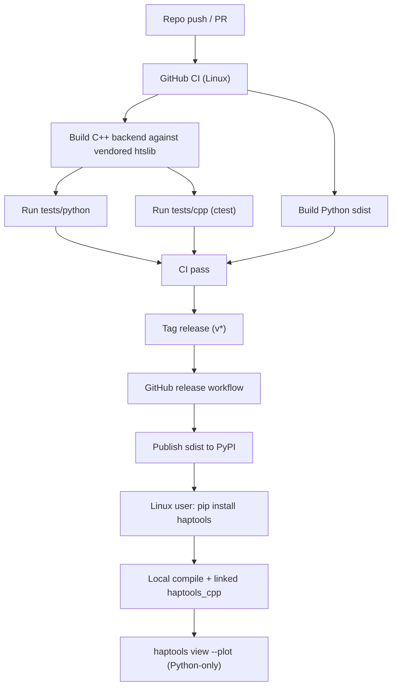

# feat: Standardize haptools Python-only architecture and Linux PyPI release lane

## Overview

Standardize `haptools` as an independently released Python/C++ project with:
- Python-only plotting/runtime behavior
- zero-R default runtime/test/CI lanes
- Linux-first PyPI publishing via source distribution (`sdist`)
- local C++ build during install with vendored `htslib`
- GitHub-based CI and release automation

This plan focuses on engineering workflow and repository architecture so contributors can build, test, and release `haptools` consistently without inheriting `geneHapR` release assumptions.

## Problem Frame

Current repository state mixes multiple historical surfaces: `haptools` Python/C++ code, legacy `R/` package assets, and ad-hoc local build/test conventions. `haptools` runtime plotting is already Python-based (`haptools/plot.py`), but project-level packaging, CI, and release conventions are not yet standardized for GitHub + PyPI publication.

Without a single packaging and workflow contract:
- contributors cannot reliably reproduce install/test paths from a clean Linux environment,
- CI cannot act as the authoritative release gate,
- PyPI publication will drift or fail due to undeclared build/runtime assumptions,
- scope confusion between `haptools` and upstream `geneHapR` can leak into runtime or release decisions.

## Requirements Trace

- R29. All `haptools` plotting entrypoints run without any R runtime.
- R30. `haptools view --plot` remains Python-only plotting.
- R31. Default `haptools` test and CI workflows run without R toolchain/deps.
- R32. `R/` and `tests/testthat/` remain optional reference assets, excluded from default `haptools` CI/release lanes.
- R33. Publish `haptools` to PyPI as `sdist` with local C++ build.
- R34. Target package name is `haptools`, with explicit fallback policy if unavailable.
- R35. v1 release platform scope is Linux only.
- R36. Install strategy vendors and links `htslib` in-project.
- R37. Repository docs provide reproducible Linux install/test workflow.
- R38. Directory architecture clearly separates active `haptools` surfaces from legacy reference assets.
- R39. GitHub CI validates Python tests, C++ tests, and packaging checks on Linux.
- R40. GitHub tag-based release workflow publishes to PyPI with repeatable process.

## Scope Boundaries

- No migration or deletion of legacy `R/` functionality in this phase.
- No expansion to macOS/Windows release targets in v1.
- No binary wheel matrix requirement in v1; source distribution is the target publish artifact.
- No redesign of hap-classification semantics in this plan; this plan is packaging/workflow/architecture-focused.
- No requirement to implement phenotype workflow or full visualization parity with legacy package.

## Context & Research

### Relevant Code and Patterns

- `haptools/cli.py` is the active Python CLI entrypoint and backend orchestrator.
- `haptools/plot.py` provides current Python-side plotting output (`render_plot_hap_table_pdf`) with no R dependency.
- `src/cpp/main.cpp`, `src/cpp/view_backend.cpp`, `src/cpp/vcf_reader.cpp` are active C++ backend components.
- `CMakeLists.txt` currently requires system `htslib` via `pkg-config`, conflicting with vendored dependency goal.
- `tests/python/` and `tests/cpp/` already provide the default `haptools` test surface.
- `.github/workflows/` and top-level Python packaging files (`pyproject.toml`) are currently absent.

### Institutional Learnings

- No `docs/solutions/` artifacts currently exist; no institutional implementation learnings were found.

### External References

- PEP 517/518 build system standard for Python packaging.
- PyPI source distribution publishing model.
- CMake + Python packaging integration patterns (e.g., `scikit-build-core` style workflows).
- GitHub Actions trusted publishing model for PyPI.

## Key Technical Decisions

- `haptools` is the only implementation/release scope in this lane.
  Rationale: avoids conflating upstream `geneHapR` lifecycle with this project's delivery contract.

- Keep plotting Python-only and encode this in runtime contract + tests.
  Rationale: requirement alignment (R29-R30) and clear separation from legacy R assets.

- Use Linux-first `sdist` publication with local C++ build.
  Rationale: matches requested release model (R33, R35) while avoiding premature wheel matrix complexity.

- Vendor `htslib` in-repo and remove hard dependency on system `pkg-config htslib` for default build path.
  Rationale: reduce user installation friction and improve reproducibility (R36).

- Establish GitHub as the authoritative CI/CD surface.
  Rationale: consistent contributor workflow and controlled PyPI publishing (R39-R40).

- Keep legacy `R/` and `tests/testthat/` as reference-only surfaces in this phase.
  Rationale: preserve history while enforcing zero-R default lanes for `haptools` delivery (R31-R32).

## Open Questions

### Resolved During Planning

- Should this plan target `haptools` scope only or include upstream package migration?
  Resolution: `haptools` scope only.

- Should default test/CI lanes remain R-dependent?
  Resolution: no; zero-R default lanes.

- Should v1 release target be Linux only?
  Resolution: yes.

- Should install path require system `htslib`?
  Resolution: no; vendored `htslib` is default.

### Deferred to Implementation

- Exact fallback package name policy if `haptools` is unavailable on PyPI.
  Reason: requires real-time namespace check near release cut.

- Vendored `htslib` mechanism (`git submodule` vs vendored snapshot).
  Reason: both satisfy requirement; selection should align with maintainer update policy.

- Whether release flow enforces TestPyPI gate before production PyPI for every tag.
  Reason: operational tradeoff can be finalized with maintainer preference during workflow implementation.

## High-Level Technical Design

> This illustrates the intended approach and is directional guidance for review, not implementation specification. The implementing agent should treat it as context, not code to reproduce.

## Implementation Units

- [x] **Unit 1: Normalize repository architecture and contributor workflow boundaries**

**Goal:** Make `haptools` active surfaces explicit and decouple default workflows from legacy R surfaces.

**Requirements:** R31, R32, R37, R38

**Dependencies:** None

**Files:**
- Create: `docs/architecture/haptools-repo-layout.md`
- Create: `docs/development/haptools-linux-workflow.md`
- Modify: `README.md`
- Modify: `docs/brainstorms/2026-04-14-haptools-cli-rewrite-requirements.md` (cross-links only, if needed)

**Approach:**
- Define primary maintained paths (`haptools/`, `src/cpp/`, `tests/python/`, `tests/cpp/`, packaging files, GitHub workflows).
- Mark `R/` and `tests/testthat/` as reference-only in default `haptools` lanes.
- Document one canonical Linux dev path for setup, build, and test.

**Patterns to follow:**
- Existing spec docs style in `docs/specs/haptools-view-cli.md` and `docs/specs/haptools-result-schema.md`.

**Test scenarios:**
- Test expectation: none -- documentation and boundary-definition unit.

**Verification:**
- Contributors can identify default `haptools` runtime/test/release scope from top-level docs without ambiguity.

- [x] **Unit 2: Establish Python packaging foundation for Linux source distribution**

**Goal:** Add PyPI-compatible packaging metadata and install path for `haptools` (`sdist` first).

**Requirements:** R33, R34, R35, R37, R39

**Dependencies:** Unit 1

**Files:**
- Create: `pyproject.toml`
- Create: `MANIFEST.in`
- Create: `haptools/__main__.py`
- Modify: `haptools/__init__.py`
- Modify: `haptools/cli.py`
- Test: `tests/python/test_packaging_contract.py`

**Approach:**
- Adopt a PEP 517 build backend compatible with existing CMake build (e.g., scikit-build-core style integration).
- Define package metadata, Python requirements, and Linux classifiers.
- Add console entrypoint contract for `haptools` command.
- Ensure source distribution includes C++ sources and vendored third-party sources required for build.

**Execution note:** Start with failing packaging-contract tests (entrypoint/import/version) before metadata wiring.

**Patterns to follow:**
- Existing Python CLI contract tests in `tests/python/test_haptools_cli_contract.py`.

**Test scenarios:**
- Happy path: editable/local install exposes `haptools` command and invokes CLI.
- Happy path: `python -m haptools` resolves to same CLI behavior as console command.
- Happy path: packaging metadata exposes consistent project/version metadata.
- Edge case: installation from source tree without prebuilt binary still succeeds when toolchain is available.
- Error path: missing required build tools fails with actionable error messaging.
- Integration: installed package can run a minimal `haptools view` call against fixture data.

**Verification:**
- `sdist` can be built and installed on Linux with documented prerequisites.

- [x] **Unit 3: Integrate vendored htslib into default C++ build path**

**Goal:** Remove default reliance on system `htslib` and build/link against vendored source.

**Requirements:** R33, R36, R39

**Dependencies:** Unit 2

**Files:**
- Create: `third_party/htslib/` (or managed equivalent vendored location)
- Create: `cmake/htslib.cmake`
- Modify: `CMakeLists.txt`
- Modify: `src/cpp/main.cpp` (only if interface glue changes)
- Test: `tests/cpp/vcf_reader_test.cpp`
- Test: `tests/cpp/view_backend_test.cpp`
- Test: `tests/python/test_haptools_real_vcf.py`

**Approach:**
- Replace hard `pkg-config htslib` requirement with vendored dependency resolution in CMake.
- Keep optional override hooks for advanced users, but default to vendored path.
- Ensure built backend remains discoverable by Python CLI (existing `HAPTOOLS_CPP_BIN` override preserved).

**Execution note:** Characterize current linker/runtime behavior before replacing dependency resolution.

**Patterns to follow:**
- Existing CMake target structure in `CMakeLists.txt`.

**Test scenarios:**
- Happy path: clean Linux environment without system `htslib` builds backend successfully.
- Happy path: C++ tests pass against vendored-linked backend.
- Happy path: Python integration tests pass with default backend discovery.
- Edge case: explicit backend override via `HAPTOOLS_CPP_BIN` still functions.
- Error path: broken or missing vendored source yields clear configure-time failure.
- Integration: end-to-end `haptools view` path works after install-built backend.

**Verification:**
- Default build/test/install no longer depends on system `pkg-config htslib` presence.

- [x] **Unit 4: Enforce Python-only plotting and zero-R default test lanes**

**Goal:** Ensure runtime and default test flows do not require any R runtime/dependencies.

**Requirements:** R29, R30, R31, R32

**Dependencies:** Unit 2, Unit 3

**Files:**
- Modify: `haptools/cli.py`
- Modify: `haptools/plot.py`
- Modify: `tests/python/test_haptools_cli_contract.py`
- Modify: `tests/python/test_haptools_real_vcf.py`
- Create: `tests/python/test_python_only_plotting_contract.py`

**Approach:**
- Keep plotting backend metadata explicit in output contract.
- Add regression tests that fail on accidental R invocation or R-only code path introduction.
- Remove any residual references that imply runtime R dependency in default `haptools` docs/tests.

**Patterns to follow:**
- Existing plotting path in `haptools/plot.py` and output contract checks in Python tests.

**Test scenarios:**
- Happy path: `haptools view --plot` emits plot artifacts and reports Python plotting backend.
- Happy path: plot mode with region and BED selectors remains functional.
- Edge case: plot + annotation mode still avoids non-Python plotting paths.
- Error path: if plotting backend metadata is missing or non-python, contract tests fail.
- Integration: full `tests/python` suite passes in environment without R installed.

**Verification:**
- Default runtime and Python test lanes pass without `R`/`Rscript` in environment.

- [x] **Unit 5: Implement GitHub CI and release workflows for Linux + PyPI**

**Goal:** Make GitHub the authoritative automation surface for validation and publication.

**Requirements:** R35, R39, R40

**Dependencies:** Unit 2, Unit 3, Unit 4

**Files:**
- Create: `.github/workflows/ci.yml`
- Create: `.github/workflows/release.yml`
- Create: `docs/release/pypi-release.md`
- Modify: `README.md`

**Approach:**
- CI workflow: Linux jobs for package build smoke, Python tests, and C++ tests.
- Release workflow: tag-triggered build + publish path for `sdist` artifact.
- Prefer trusted publishing/OIDC where possible; document required repository settings and secrets fallback.
- Keep release workflow aligned with Linux-only scope.

**Execution note:** Start with failing CI workflow dry-run on branch before enabling release trigger.

**Patterns to follow:**
- Existing command/test workflow already used in local WSL verification (`pytest`, `ctest`).

**Test scenarios:**
- Happy path: PR workflow runs and passes Python + C++ + packaging checks.
- Happy path: tag workflow builds release artifact and executes publish lane.
- Edge case: non-tag pushes do not execute production publish step.
- Error path: publish credentials/configuration issues fail fast with actionable logs.
- Integration: release documentation steps reproduce CI behavior locally on Linux.

**Verification:**
- GitHub workflows enforce merge/release quality gates matching local documented process.

## System-Wide Impact

- **Interaction graph:** Packaging layer now coordinates Python CLI entrypoints, CMake backend build, vendored third-party dependency, and CI/release automation.
- **Error propagation:** Build-time failures (toolchain, vendored dependency, packaging metadata) must surface before runtime CLI operations.
- **State lifecycle risks:** Drift between local workflow docs and CI workflow definitions can silently break release confidence.
- **API surface parity:** CLI behavior must remain unchanged for users while packaging/release internals evolve.
- **Integration coverage:** End-to-end validation must include installation, backend discovery, and representative `view --plot` behavior.
- **Unchanged invariants:** Legacy R package behavior is not modified by this lane; only default `haptools` delivery surfaces are standardized.

## Risks & Dependencies

| Risk | Mitigation |
|------|------------|
| PyPI name `haptools` unavailable at release time | Define fallback policy in release docs before first tag cut |
| Vendored `htslib` update burden over time | Document update procedure and ownership in architecture docs |
| Linux source-build friction for users | Provide explicit prerequisite list and smoke-test install instructions |
| CI and local workflows diverge | Keep one canonical command set in docs and reuse in workflows |
| Hidden R dependency reintroduced | Add explicit Python-only plotting contract tests |
| Release workflow misconfiguration | Dry-run on TestPyPI or pre-release tags before first production publish |

## Documentation / Operational Notes

- Keep top-level README focused on `haptools` install/build/test/release lanes.
- Add contributor workflow doc for Linux development path.
- Add release runbook for GitHub tag to PyPI publication.
- Explicitly document that `R/` is reference-only for this phase.

## Sources & References

- **Origin document:** `docs/brainstorms/2026-04-14-haptools-cli-rewrite-requirements.md`
- Related code: `haptools/cli.py`
- Related code: `haptools/plot.py`
- Related code: `CMakeLists.txt`
- Related code: `tests/python/test_haptools_cli_contract.py`
- Related code: `tests/python/test_haptools_real_vcf.py`
- Related code: `tests/cpp/vcf_reader_test.cpp`
- Related code: `tests/cpp/view_backend_test.cpp`
